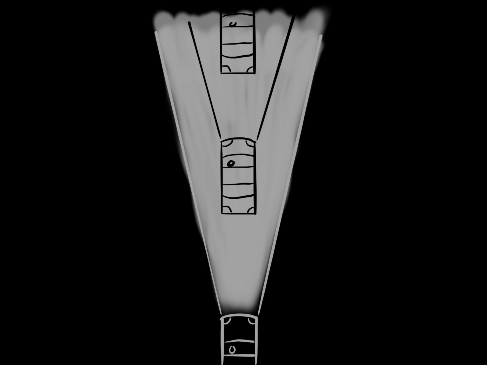
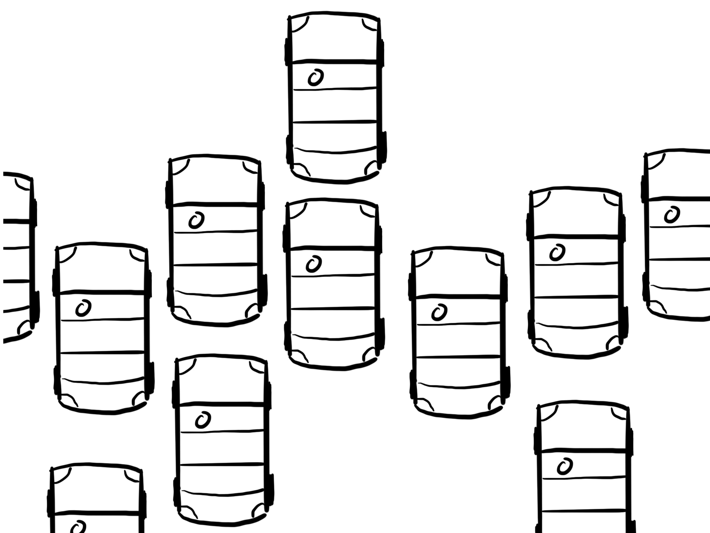
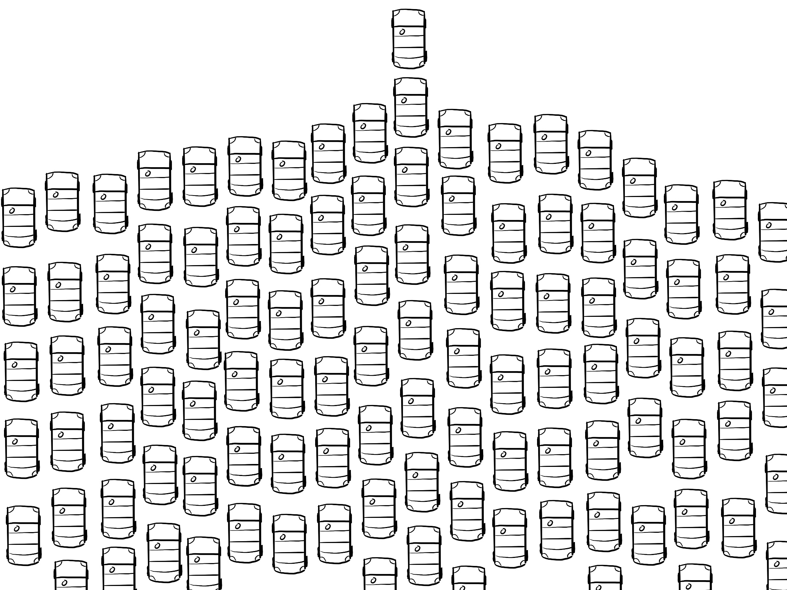

I've been struggling a lot lately with my inner self-talk. It's never been all that fantastic but even worse than usual lately. I think this is the result of the difficult year we're all facing and a new venture I'm undertaking that has me really doubting myself.

"Great opener, Kyle! Really got us in good spirits!" you say.

I know, but bear with me. Part of why I get like this is I am _wired_ to look at people more successful than me and compare myself to them. I could write endlessly about people I admire and could never be like. Whenever I get like this, stuck in my comparisons, I try and think about a metaphor that my friend [Jason Lengstorf](https://twitter.com/jlengstorf) shared with me a year or two ago that I think is just brilliant.

When you're struggling with confidence and doubt, and perhaps feeling further behind than your peers, consider this scenario:

Imagine you're in a car, driving down a dark road in the middle of the night. Naturally, you have your headlights on.

When you're driving at night and you have your headlights on, what _exactly_ can you see?

Turns out, not a whole lot.

You can only see what is more or less _directly_ in front of you. You can see a few other cars that are further on their journey than you are. _Why_ are they further ahead?

Maybe they had a head start, maybe they have a fancier car, maybe they're a better driver, who knows? But notice, really _notice_, that what you see in this tiny sliver of light shooting out from the front of your car, is but a small fragment of what's actually out there in the dark.

If it wasn't dark, and we didn't need our headlights, and we looked around in all directions, what would we see?

We would see that there are _many_ people driving outside of our headlight vision, in all sorts of directions.

There are some way to the left. There are some way to the right.

And multitudes and multitudes more people behind us.

There are even people who aren't on the road yet that soon will be.

If you're always driving in the dark with your headlights on, you'll only notice the people directly ahead of you.

Sure, you can strive after them. Put your foot on the gas pedal and go, but there's almost certainly always someone else still out in front. It's exhausting to try and keep up and there's a good chance you'll run out of gas. You will probably feel, as I often do, like shit because you aren't where they are.

If and when this happens, remember that you need some daylight and a broader perspective. Remember there are people all around you, and what you do may not make an impression on those ahead of you, it will be tough to see in a rear-view mirror, but can make a huge difference to the people left, right, and behind you.

Keep them in mind. Don't get locked into your headlights. And drive safe.
