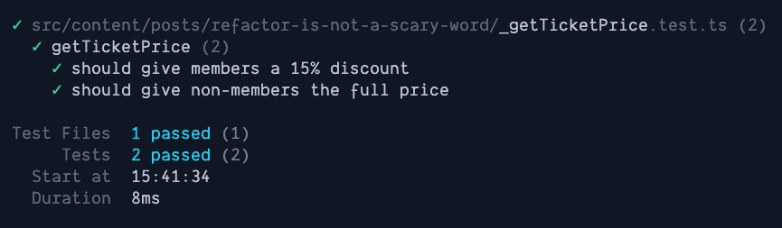
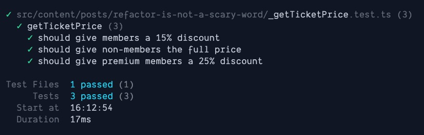

One thing I've struggled with throughout my life is using a word with a specific definition that gets interpreted differently. It causes me a great deal of frustration. <Marker content={`In my childhood, I read the book "The Giver" by Lois Lowry. At one point, the main character makes an exaggerated statement, to which the parents admonish him with, "Precision of language!" I felt understood when I read that.`} /> It might be unreasonable to expect people to walk around with a Merriam-Webster's dictionary in their pocket, <Marker content="Actually, I can. 📱" /> so mistakes are bound to happen.

I recently lost a potential client and I'm convinced the reason why is because we had different definitions for a single word: &ldquo;refactor&rdquo;.

&ldquo;I'll need to refactor some of these components to support your new use cases.&rdquo; This was a benign, workaday statement using common jargon for software engineers, yet I could tell it struck fear in this client. I never had a chance after that.

I don't know when it happened, but &ldquo;refactor&rdquo; became a **scary** word, and we need to get it back.

### Why is it a scary word?

I have no research to back up what I'm about to claim, but my suspicion is that people recoil at the word &ldquo;refactor&rdquo; because it's caused them trauma, primarily in the way of costs.

I think somehow it has become an ambiguous term in the industry roughly meaning "large, time-consuming, and potentially dangerous changes to code." I find this deeply upsetting as it's essentially the _opposite_ of what the word means, which I will discuss shortly.

Without adherence to a strict definition, I imagine there have been many instances where an engineer mentioned "we need to refactor this" to a manager, and next thing you know, the roadmap ends up derailed, or the project is a failure, or even worse, the company goes out of business.

These outcomes shouldn't be the result of refactoring, and we should really get on the same page about the word to avoid this from happening.

### What does the word actually mean?

When I use the word &ldquo;refactor&rdquo; or "refactoring", I mean these two specific definitions that come from the book "Refactoring" by Martin Fowler:

- **Refactoring** (noun): a change made to the internal structure of software to make it easier to understand and cheaper to modify without changing its observable behavior.
- **Refactoring** (verb): to restructure software by applying a series of refactorings without changing its observable behavior.

The key part of the definition here is **&ldquo;without changing observable behavior&rdquo;**.

If you are refactoring, it does not mean rewriting the code from scratch. It does not mean making some changes _while_ adding new features. It doesn't even mean changing the structure and _hoping_ it's the same. **It means changing the structure of the code _knowing_ it's the same.**

There should be _no_ equivocation about this.

### Implications of the proper definition

The only way to make changes while knowing the observable behavior hasn't changed is to have a testing suite that can confirm or deny this. Honestly, if you've avoided writing tests in your career, you're doing yourself a disservice. Coding is one of the few industries where we can cheaply and easily verify our work is correct. All it takes is writing a few lines of code. Imagine doing something similar in the physical world, where testing might cost just as much as the actual implementation.

Extrapolating from this, if we must keep the tests green as we make our changes, I think it suggests two things:

- The changes we make should be small, incremental steps to our goal

We should be able to make each change to our code in an understandable fashion. The way we accomplish big changes is through the composition of many small ones. With each small change, we should keep the tests green.

- These small changes reveal algorithmic patterns, aka refactorings, that are repeatable

We can define what are essentially "recipes" for restructuring code, and for those keen on reading the book, they provide over 60 of them to get started. There are more that can be defined as well.

This means that when we're doing a refactoring properly, we should be doing the following:

- Tests related to the code we are changing should be running in a watch mode
- We should be able to make an atomic commit with each step <Marker content="Some changes, such as <em>Rename Variable</em> are so small it might not warrant a commit, but it's hopefully obvious how one could do so." />

### An example

I'm going to make a rudimentary example to demonstrate how we might refactor a function, without changing it's behavior, that will make it much easier to enhance in the future.

Here we have a `getTicketPrice` function. It receives a `Show` as an argument. Members get a 15% discount on ticket prices, while non-members pay the full price. Our function looks like this:

```typescript
type Show = {
  name: string
  /**
   * The price in cents. Typically it's better to store money as an object, but
   * here we'll make the assumption we're working with US currency.
   */
  price: number
}

function getTicketPrice(show: Show, isMember: boolean) {
  return isMember ? show.price * 0.85 : show.price
}
```

The tests for a function like this are fairly straightforward. I'll write them in a style that's compatible with Vitest or Jest:

```typescript
describe('getTicketPrice', () => {
  const show: Show = {
    name: 'Test show',
    price: 1000,
  }

  it('should give members a 15% discount', () => {
    expect(getTicketPrice(show, true)).toEqual(850)
  })

  it('should give non-members the full price', () => {
    expect(getTicketPrice(show, false)).toEqual(1000)
  })
})
```

Running our tests shows that they're working.



Let's say we learn that we now offer different levels of memberships. A member might be a basic member or a `premium` one. Members of `premium` status will get an even greater discount of 25%. What does this mean for our function?

The first obvious thing we'll need to refactor is the `isMember` boolean. Simply put, we won't be able to represent three possible membership levels with a boolean. I haven't come across a name for the refactoring we'll do, but I think _Boolean to Variant_ might be a good one. As we make this change, remember
we're trying to keep the same observable behavior.

```typescript
type Show = {
  name: string
  price: number
}

// We'll add a membership type and represent our two current states
type Membership = 'member' | 'non-member'

// We'll use that type instead of the boolean
function getTicketPrice(show: Show, membership: Membership) {
  // We'll update our implementation to use our membership instead
  switch (membership) {
    case 'member':
      return show.price * 0.85
    case 'non-member':
      return show.price
  }
}
```

We'll need to make a small change to our tests, but we'll see that they continue to pass. An added benefit is we removed a [flag argument](https://martinfowler.com/bliki/FlagArgument.html) in the process:

```typescript
describe('getTicketPrice', () => {
  const show: Show = {
    name: 'Test show',
    price: 1000,
  }

  it('should give members a 15% discount', () => {
    expect(getTicketPrice(show, 'member')).toEqual(850)
  })

  it('should give non-members the full price', () => {
    expect(getTicketPrice(show, 'non-member')).toEqual(1000)
  })
})
```

Are tests are still green with that change. I won't share a picture, it's exactly the same as before.

That said, I think we're at a place we can add our new feature. Given the nature of this function, we can write the additional test first, then get it passing:

```typescript
it('should give premium members a 25% discount', () => {
  expect(getTicketPrice(show, 'premium')).toEqual(750)
})
```

Our test fails, so let's get it passing. To do so, we'll add a `premium` variant to `Membership` and account for it in our function:

```typescript
type Show = {
  name: string
  price: number
}

type Membership = 'member' | 'non-member' | 'premium'

function getTicketPrice(show: Show, membership: Membership) {
  switch (membership) {
    case 'premium':
      return show.price * 0.75
    case 'member':
      return show.price * 0.85
    case 'non-member':
      return show.price
  }
}
```

And our tests are passing again.



There might be more that we can do to this function. We could even argue a bit about the best way to do its implementation, but hopefully it gave you some insight into the process of changing code with safe refactorings.

### Final thoughts

We need to reclaim &ldquo;refactor&rdquo; because this process of restructure, verify, add feature, verify is simply just doing the job. I don't want to have to use euphimisms to describe my work just so managers don't freak out when changes are necessary. I think if refactors remain scary, then we actually make our work more dangerous for ourselves. Avoiding making changes only makes the code more complex and likely more error prone as well.

If we can embrace refactoring as a safe, atomic way to change code and recognize that it's just a part of the day to day work, I think we can drop the stigma and start improving the codebases we work in.
