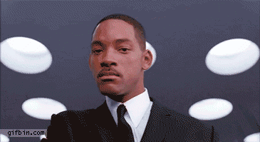

It has been one year since Anna and I moved from Pasadena to Portland. I thought it might be a good idea to recap some of what has happened during that time and review some of what we had hoped would happen in moving.

## Arrival

I think I can safely speak for both of us that we were really nervous about the neighborhood and apartment we were moving into when we first got here. We had not had the fortune of visiting the city before our move to try and find apartments, and knew so little about the town that our search would have probably been as futile as our internet searches 800 miles away. Yet, after the initial shock of the move, we began to realize that we had actually been incredibly blessed with our find. Here are a few of the reasons why:

1. **Our neighborhood is great.** We live next to a fantastic park that we can go on evening strolls in with a gorgeous rose garden. There are several great coffee shops within walking distance. Not to mention...
2. **Transportation is a breeze for us.** We live a 10-minute walk from the Yellow Max Line (the local train line) which goes directly into downtown where it's a short 5-minute walk for me to get to work. This has been incredibly convenient for us (despite how much I've grown to hate the train for other reasons meant for another blog post). Also, we live right next to I-5, which provides us with a faster means of getting around the city than if we were to live more in the heart of any of Portland's five quintants (think quadrant with 5 zones. Northeast, Northwest, Southeast, Southwest, and then North Portland (which we live in)).
3. **Our rent is about as cheap as we can find it and still live in the city proper.** When we first moved, we were worried that we actually had found a place too far north, but because of our access to I-5 and the 30 bypass, we actually have it easier than most to get around the town. And anything with a rent about the same price is much further to the east or west than we really want to live right now. There may come a time where we make the choice to move to a more affordable area of Portland (to get a bigger place), but for now, it's hard to complain about what we pay when considering where we live.
4. **We can get to some great neighborhoods very quickly.** Mississippi, The Pearl, Alberta Arts District. All of these are less than 10 minutes away from us and it's a lot of fun to be able to get to these great parts of Portland quickly.

## The Weather

How could we move to Portland without discussing the weather? When we first arrived in Portland, it deluged for two straight weeks. Having moved from SoCal, Anna and I were really worried that we had gotten in over our heads in regards to the rain. Everyone we met assured us that it was more rain than usual. We didn't believe them. Thought they were lying to us to make us feel good. Turns out, they were telling the truth.

Crazy factoid: Average rainfall per year is greater in New York than it is in Portland.

Portland weather is actually pretty fantastic, once you get used to the pattern. From November to April, the sky is mostly gray and constantly misting or drizzling. However, it rarely drops cold enough to actually snow (we had one good snowfall this winter). While this was a bit colder than Anna had ever experienced, it was still really mild compared to the winters I knew growing up. This meant that if you were willing to get a little cold and little wet, you could still do physical, outdoors activities year round. I love that about Portland.

From May through October, we have had fantastic weather. It's hardly rained all summer (the grass has actually turned brown), with most days sitting in the 80-85 range. I personally love that level of heat, for other native Oregonians, it's a bit warm for them. Regardless, summer has been beautiful here, perfect for camping and hiking and being outside all day.

Not to mention, it stays light out until 10pm! Because we are significantly further north than either Anna or I have ever lived, we get much longer days in the summer than we are used to. Granted this means we get shorter days in the winter than we are used to, but it comes with the territory.

## Our Expectations and Hopes

Last year, I wrote a goodbye letter that [you can read here](http://kyleshevlin.com/goodbye-pasadena/). In it I laid out a few things we had hoped to find in Portland. I want to review those.

1. The cost of living has been significantly cheaper in Portland than it was in Los Angeles. The lack of a sales tax goes a long way. It's pretty nice to buy things for the price actually listed on the sticker. That being said, housing is still pretty high, especially for renters, which of course makes it more difficult to save to get into a home. We're working on it though.
2. Having been here a year, we certainly are right that there are many opportunities for the artist and musician here in Portland; however, neither of us (and especially me) have put in the time or effort needed to really engage in this community. Honestly, I've found it difficult to write music since marriage. I've gone into this before, but the short version of the story is that I used to write when I was alone, and frankly lonely, and depressed really late at night. Now, we share a tiny apartment, work takes up most of my time, and the hours in the evening that I used to spend alone with my thoughts and my guitar get taken up by other things. It's kind of the same with Anna's painting and photography. We're trying to come up with solutions that will allows us more time to work and the privacy and space we need to be creative, but it is difficult. I think you can expect more blog posts about this idea, since the creative process fascinates me so much. Regardless, having looked back and realizing I have not pursued my goals has made me realize that it's time to refocus and get back to working on my music.
3. Anna did find work in a non-profit, though not working for one of the ones she was originally interested in. I think that is the nature of the beast though. NPOs tend not to have the freedom to hire liberally.
4. Anna's love of sweaters still abounds, but we don't get to actually wear them year-round. Summer has actually been pretty toasty, especially without air conditioning. Though just this morning, I put my beanie (toboggan to those of you who call it that) for the first time in many moons, so fall is quickly approaching.

## Our Disappointments

I have saved this section for the last because it could honestly be this biggest one and, in fact, is worthy of several posts (I've actually been working on a bunch, I have about a dozen drafts, but its hard to find the right words to express some of the challenges we have faced). I wanted you all to read what we've enjoyed of Portland first before we expressed our disappointments.

Specifically, the number one issue we have is a lack of community and friends. Being perfectly honest, at this point we have made really good friends with one couple, and would say we have budding friendships with a handful of other people. Yet, it is still nothing compared to the friends we left behind. Weekends have become difficult times. We both desire to interact with people, to simply have conversations with people other than ourselves, but it seems really challenging and difficult to arrange.

I think that is part of the issue itself. They never teach you this as a child, but adulthood makes being spontaneous with others incredibly difficult. If you work at a full time job, 10-11 hours of your day are taken away from you between work, commute, and prep time. This leaves you with enough time to do maybe one thing in your evening and if your friends live further than a house or two down from you, it might be months before you see them again, because in order to get together you need to plan that time together. I think anyone reading this understands what I mean. It's not that planning is a bad thing, but I think most of us desire the freedom and leisure to actually be able to be more whimsical and free with our time. I know I often wish, generally around 9:30pm, that it was more socially acceptable to call someone up to spontaneously hang out for an hour or so. But lack of proximity and the daily grind inhibit such interactions. I could go on and on, and probably will in some other blog posts. I need to address another point before I lose you entirely.

Part of our struggle to find friends has been that we simply don't have many means to meet and engage new people to make potential friends. This is what we had hoped to accomplish by finding a good church community. However, this search has been in vain, and we have actually largely given up on going to church. Now this is a topic that I am certainly trying to write about (though trying to do so without simply being cynical has been a big challenge), but I will give you the tl;dr version here.

We tried well over a dozen churches when we got here, but we left each one of them with the same frustrations. We've been able to nail down why we felt this way, and why we stopped going.

Churches all across America focus on primarily two things, providing education via sermons and providing worship via music. All other things become tertiary to these two things. Anna and (especially) I have come to believe that this is a fundamental mistake. I don't have the time or space to get into that right now, but we believe that we need to decentralize these foci and instead design a church whose primary focus is community. Rather than treat community as the accidental by-product of being in proximity of people in pews on a weekly basis, we would like to make the Sunday service specifically about developing community, friendships, and relationships with others (since this is something so many of us, not just Anna and me, are missing). We really aren't interested in sermons, most of them being some kind of wish-washy, feel-good, teach-white-people-to-persevere-when-they-really-don't-have-the-kind-of-problems-the-Bible-was-addressing-in-the-first-place, forty-five-minutes-longer-than-they-should-be sermon that I don't want to listen to anymore. Honestly, Jesus gave us the two greatest commandments. Go and live those out and I think you'll do alright for yourself. And worship music has never felt more vapid; what with Christian worship music being musically uninteresting and the lyrics devolving into little more than a Mad Lib for Christianese. If we are going to invest time on a Sunday morning, when we could easily be doing other things that bring us joy (like sitting at home in our sweats, enjoying chocolate chip waffles, a cup of coffee and each other's company), then it needs to be as beneficial and restorative as those other activities. Thus, Anna and I have been discussing the idea of beginning a new type of gathering. I'll write more about it later, but for now you get the gist.

Having given up on churches, though, has meant that we have had to try other avenues for meeting people, most of which have also not worked out for us. We tried Meetups, but most of them were so clique-ish that it felt like we were both back in high school (not a good time for either of us) and rendered us incapable of penetrating into a social group anywhere.

We thought that our workplaces might provide us with some social interaction, but Anna more or less works alone all day, and well, the things that made me a popular person at Fuller do not make me a popular person at FINE. I love working at FINE, and I've got a few work pals, but I just don't seem to gel as well as I did at Fuller. My humor, my interests, my personality, I've always seemed to rub just enough against the grain to not be able to be embraced by a group. I've come to realize my time at Fuller really was something special and will likely not be experienced again. Oh well.

I also had hoped that I would be able to find some friends through the ultimate community. I have played **a lot** of ultimate since getting here. Though I have made a lot of on-the-field friends, I have yet to successfully transfer any of those friends to the off-the-field category.

Anna has had it even rougher than I have. She was out of work for many months. Very bored and home, and honestly, depressed. Now that our finances are starting to stabilize, we are hoping to maybe find some activities and groups that we can join together, but also that Anna can explore on her own. It's always important for people to develop their individual passions and interests.

I think the shortest way I could have summed all this up would be to say, in the event of an emergency, we'd quickly run out of people to call up here. I don't think this is how humans were meant to be, but a full reflection on the topic needs to be reserved for another time.

## Conclusion

Portland's a great city, but the Northwest Freeze is hard to get through, especially when you simply aren't meeting people. What we thought would be the source of community, turned into a source of our greatest frustration, though we are hoping that God will continue to motivate us and provide us the opportunity to pursue something different than the Church and Portland has ever seen. Lastly, we are striving to be patient, positive, and creative in our approach toward building community, as we have become more certain that it is simply one of the most important things to have in life.

Thanks for reading all of this if you got this far. Here's a gif for you as a reward.

