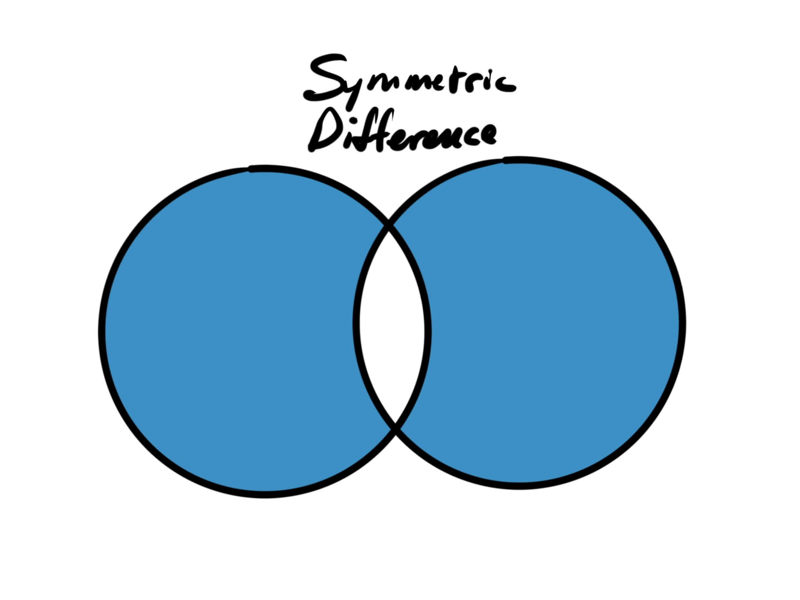
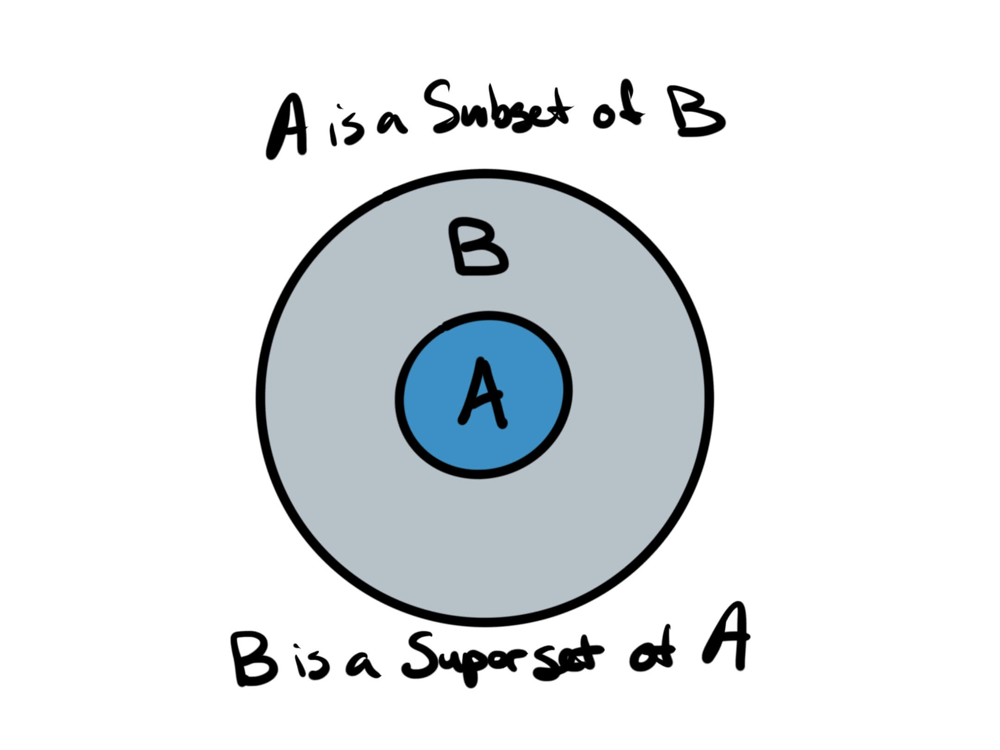

I find Sets and set theory to be a fascinating concept, both in the abstract <Marker content="As a mathematical and philosophical concept." /> and in the concrete <Marker content="I enjoy using them in JavaScript" />, and one that I find more and more useful as time goes on. I've wanted to write an introductory post on the topic for a while now and hope it might inspire a similar interest in Sets for you.

### What is a Set?

A Set is a collection of unique elements. Those elements can be literally anything. There exists the set of all integers that are factors of 3, the set of all aquatic mammals, the set of all of _my_ siblings.

A Set can be full of many elements, such as the set of all blades of grass in my lawn <Marker content="Sorry, looking at my backyard as I write this!" />, or a set can be empty, such as the set of all humans living on planets other than Earth.

Sets, **in the abstract**, also don't have a sense of "order". If I'm talking about the set of all whole numbers between the values of `1` and `5`, they do not _necessarily_ need to come in the order: `1, 2, 3, 4, 5`. They can be thought of just as equally in the order: `2, 1, 4, 3, 5` or any other order. <Marker content="In the concrete, a <code>Set</code> data structure in JavaScript does have order and can be iterated over with <code>for..of</code>" /> In this way, Sets are like [bag data structures](http://web.engr.oregonstate.edu/~sinisa/courses/OSU/CS261/CS261_Textbook/Chapter08.pdf).

Throughout the rest of this post, I will be using drawings to aid in my explanation, so to get started, here's a Set:


It is important to note that Sets often exist within a universe:


### Sets interacting with other Sets

Sets become far more interesting (and useful) when we consider how they interact with one another.

#### Unions

The union of Set A and Set B is the Set containing _all_ the elements from Set A _and_ all the elements from Set B.


```javascript
function union(setA, setB) {
  // Make a copy
  const result = new Set(setA)

  for (let element of setB) {
    result.add(element)
  }

  return result
}
```

#### Intersections

The intersection of Set A and Set B is the Set containing the elements in Set A _that are also_ in Set B. You may recognize this as a Venn Diagram.


```javascript
function intersection(setA, setB) {
  const result = new Set()

  for (let element of setA) {
    if (setB.has(element)) {
      result.add(element)
    }
  }

  return result
}
```

#### Differences

The difference of Set A and Set B is the Set containing all the elements from Set A that are _not_ in Set B.


```javascript
function difference(setA, setB) {
  const result = new Set()

  for (let element of setA) {
    if (!setB.has(element)) {
      result.add(element)
    }
  }

  return result
}
```

Note that the `difference` between two sets is dependent upon the order of the arguments. That is, given that Set A and Set B are not equal sets, then `difference(setA, setB)` will not be equal to `difference(setB, setA)`

#### Symmetric differences

The symmetric difference of Set A and Set B is the Set containing all the elements that are _not shared_ by Set A and Set B.



```javascript
function symmetricDifference(setA, setB) {
  const result = new Set()

  for (let element of setA) {
    if (!setB.has(element)) {
      result.add(element)
    }
  }

  for (let element of setB) {
    if (!setA.has(element)) {
      result.add(element)
    }
  }

  return result
}
```

Not, unlike `difference`, `symmetricDifference` will achieve the same result regardless of argument order. In this case, `symmetricDifference(setA, setB)` will result in the same set as `symmetricDifference(setB, setA)`.

#### Complements

The complement of a Set A is the Set containing all of the elements _not_ in Set A. By default, this would be all the other elements in the universe, but when constrained, complements can be useful.


For example, the symmetric difference of Set A and Set B is equivalent to the complement of the intersection of Set A and Set B. We can figure this out by first creating the union of Set A and Set B, then their intersection, and then getting the difference of those two results.

```javascript
const all = union(setA, setB)
const shared = intersection(setA, setB)
const notShared = difference(all, shared)
```

#### Subsets and Supersets

Set A is a subset of Set B if every element of Set A is in Set B. We can make use of `Array.prototype.every` to help us with this one.



```javascript
function subset(setA, setB) {
  return [...setA].every(element => setB.has(element))
}
```

Set A is a superset of Set B if Set B is a subset of Set A.

```javascript
function superset(setA, setB) {
  return [...setB].every(item => setA.has(item))
}
```

Subsets and supersets are useful when categorizing elements. For example, `React` is a subset of `JavaScript`. If someone tells me that they know `React`, I can safely deduce that they know some `JavaScript` as well. However, if someone tells me they know `JavaScript`, I cannot deduce that they know some `React`. They might, they might not.

### Disjointed Sets

Set A and Set B are considered disjointed if they share no elements.


Another way to think about disjointed sets is that their intersection is the empty set, and therefore has a `size` of `0`. We can use that to determine if two sets are disjointed or not.

```javascript
function disjoint(setA, setB) {
  return intersection(setA, setB).size === 0
}
```

It is not uncommon to create disjointed unions, as we will soon see.

### Where am I using Sets without maybe realizing it?

Type systems!

When you describe a `value` as the type `string`, what you're really saying is that this `value` belongs to the Set of all `string`s. When you type an `array` as `Array<number>`, you're saying that this `array` belongs to the Set of all arrays containing numbers.

This is why types that use `|` and `&` are called union types and intersection types respectively.

If I have a type that is `string | number`, I'm really saying that this item belongs to the union of the set of all strings and the set of all numbers. This is a disjointed union, since it's impossible for a value to be both shared by the set of strings and the set of numbers. <Marker content="The string of a number is still a string, at least for the sake of types and sets." />

### Are there practical uses?

Quite a few, but you have to get used to looking for them. I have used sets for tag/category systems (I use `Set`s for my tags on this site). I've used them for making efficient filtering systems, too. It's sometimes easiest to think of filtering items in terms of unions and intersections.

Another place you've probably seen them over and over is in vector drawing tools. Take a look at Figma for instance. If I make two vector shapes, select them both and then look at my options, don't these look strangely familiar? They even use some of the same words to describe the operation.


At its core, manipulating vector graphics is as simple as doing some Set operations. Every shape is a Set of points, and we can use the operations to manipulate those points into complex shapes.

### Summary

Sets are a collection of unique elements. Learning the fundamentals of Sets and set theory may open up some new ways of thinking of operating with data for you. Your mileage may vary. At the very least, I hope you find words like "unions" and "intersections" less intimidating (if they ever were at all).

### Resources

There's one specific library I like to share with people in regards to `Set`s that I want to share with you: [Zet](https://github.com/terkelg/zet). It's incredibly simple and excellent. I encourage you to read the source code as well.

### Additional Notes

It's worth noting that there are proposals to improve `Set`s in JavaScript in the works: [https://github.com/tc39/proposal-set-methods](https://github.com/tc39/proposal-set-methods). The work here will replace the need for libraries like Zet in the future.
